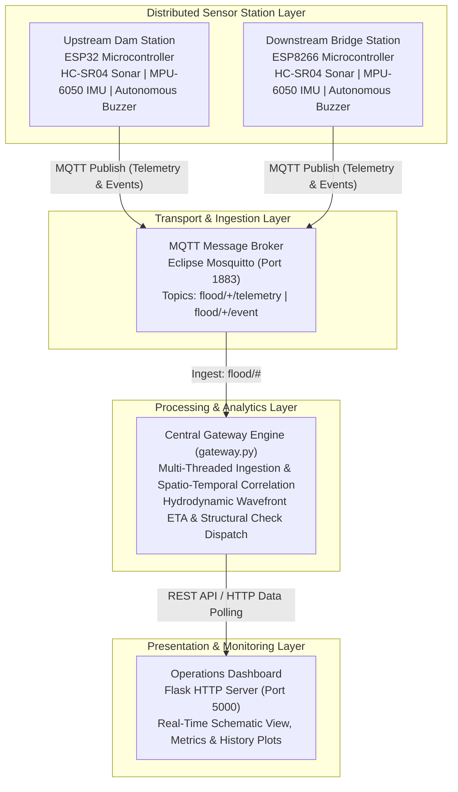
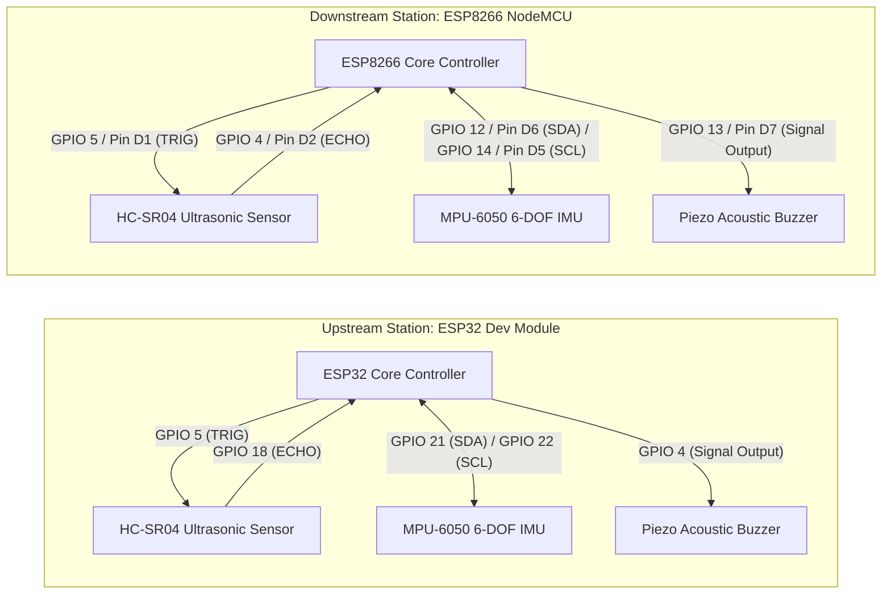
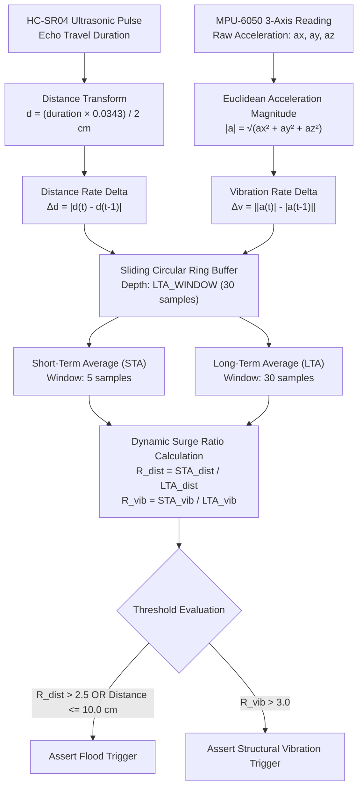
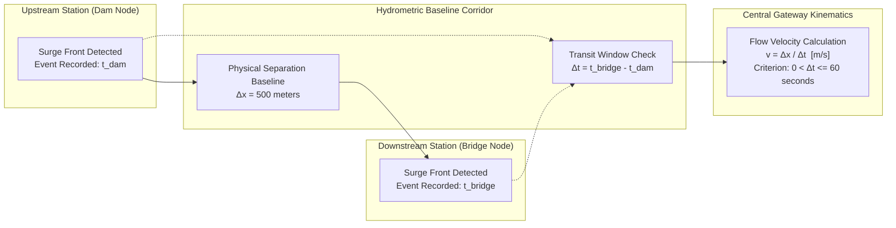
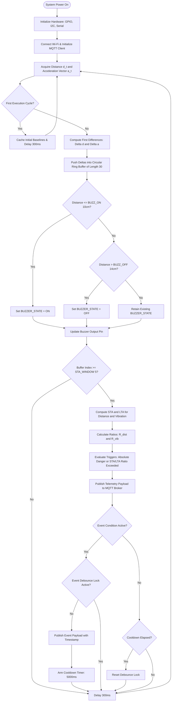

# Edge-AI Environmental Monitoring Network (EEMN)

### Distributed Hydrometric Sensing, Structural Anomaly Detection, and Spatio-Temporal Wavefront Tracking Architecture

**Project Reference:** TEKATHON-5.0 | Smart India Hackathon (Problem Statement: SIH26178)  
**Development Team:** Team Synapse  

---

## Executive Summary

The Edge-AI Environmental Monitoring Network (EEMN) is an autonomous, distributed cyber-physical sensing framework engineered for real-time hydrological surveillance, flash-flood early warning, and structural health assessment. Designed to operate under degraded communication conditions, EEMN couples deterministic edge actuation with an upstream statistical aggregation layer.

Each edge sensor node continuously captures high-frequency ultrasonic hydrometric distance measurements and multi-axis vibrational acceleration. Local firmware utilizes dual-criterion trigger logic—combining absolute boundary hysteresis with a Short-Term Average to Long-Term Average (STA/LTA) rate-of-change filter—to actuate on-site audible alarms autonomously with zero network latency. Concurrently, time-series telemetry and discrete alert payloads are published over a lightweight Message Queuing Telemetry Transport (MQTT) bus to a central gateway. The gateway correlates multi-point transient signals across spatial baselines to calculate downstream flood-wave propagation velocities and monitor infrastructure resilience.



---

## Core Architectural Principles

1. **Edge Autonomy and Offline Resilience:** Local life-safety decisions are executed entirely within edge node microcontrollers. An alert buzzer triggers within milliseconds of threshold breach without depending on Wi-Fi connectivity, MQTT broker availability, or host server status.
2. **Dual-Tiered Hydrological Detection:** Absolute distance cutoffs provide deterministic boundaries for gradual reservoir rise, while dynamic STA/LTA difference ratios detect sudden flash surges before absolute thresholds are crossed.
3. **Chatter-Free Acoustic Actuation:** Actuator states are stabilized through strict hysteresis bands (`BUZZ_ON < BUZZ_OFF`), preventing high-frequency relay or buzzer jitter when water surfaces oscillate near boundary conditions.
4. **Spatio-Temporal Kinematic Tracking:** By matching downstream timestamp deltas against upstream trigger moments, the system calculates physical surge velocity (`v = Δx / Δt`) across hydrometric intervals.
5. **Cross-Domain Structural Monitoring:** High-g shock events detected by inertial measurement units flag structural inspection directives across related assets along the river basin.

---

## Hardware Specifications and Pin Allocations

The hardware layer is deployed using ESP32 and ESP8266 microcontrollers interfacing with identical digital and analog transducers via board-specific register architectures.

### Component Bill of Materials

| Component Identifier | Functionality | Operating Voltage | Interface Type |
|---|---|---|---|
| Espressif ESP32 Dev Module | Upstream Hydrometric Station (Dam Node) | 3.3V Logic / 5V VCC | Wi-Fi 802.11 b/g/n, I2C, GPIO |
| Espressif ESP8266 NodeMCU | Downstream Hydrometric Station (Bridge Node) | 3.3V Logic / 5V VCC | Wi-Fi 802.11 b/g/n, Software I2C, GPIO |
| HC-SR04 Ultrasonic Module | Non-contact water level distance profiling | 5V VCC | Digital TTL Pulse Width |
| InvenSense MPU-6050 | 6-Axis Inertial Measurement Unit (Vibration) | 3.3V VCC | I2C (Address: 0x68) |
| Active Piezo Buzzer Module | Localized acoustic alarm actuation | 3.3V / 5V VCC | Single-ended Digital GPIO |

### Pinout Mapping Topology



| Subsystem Signal | ESP32 Pin Allocation | ESP8266 NodeMCU Pin Allocation | Description |
|---|---|---|---|
| `HC-SR04 TRIG` | `GPIO 5` | `GPIO 5` (`D1`) | 10-microsecond trigger pulse initiator |
| `HC-SR04 ECHO` | `GPIO 18` | `GPIO 4` (`D2`) | High-level return duration measurement |
| `MPU-6050 SDA` | `GPIO 21` | `GPIO 12` (`D6`) | I2C Synchronous Serial Data line |
| `MPU-6050 SCL` | `GPIO 22` | `GPIO 14` (`D5`) | I2C Synchronous Serial Clock line |
| `BUZZER OUT` | `GPIO 4` | `GPIO 13` (`D7`) | Logic-level drive for acoustic transducer |

---

## Detection Algorithms and Signal Processing



### 1. Acoustic Actuation Hysteresis Model

To prevent rapid oscillatory switching of local alarms under surface wave interference, the edge firmware enforces a Schmitt-trigger style hysteresis loop.

* **State 1 (Alarm ON):** Actuated when measured distance drops to or below `BUZZ_ON_DISTANCE_CM` (10.0 cm).
* **State 0 (Alarm OFF):** Restored to silent operation only once measured distance rises above `BUZZ_OFF_DISTANCE_CM` (14.0 cm).
* **State Retained:** When distance fluctuates between 10.0 cm and 14.0 cm, the existing buzzer state is maintained without modification.

**Parameters:**
* `d(t)`: Current instantaneous distance reading from sensor to water boundary (cm).
* `D_ON`: Critical danger threshold (10.0 cm).
* `D_OFF`: Hysteresis reset threshold (14.0 cm).
* `ΔH = D_OFF - D_ON`: 4.0 cm deadband preventing switching transients and relay chattering.

### 2. Dual-Window STA/LTA Surge Detection

To detect abrupt flash-flood fronts independently of static water height, the edge processor calculates the ratio between short-term rate averages and baseline ambient rates.

#### Rate-of-Change Formulation
* **Distance Rate Delta:** `Δd(t) = |d(t) - d(t-1)|`
* **Vibration Rate Delta:** `Δv(t) = ||a(t)| - |a(t-1)||`

Where `|a(t)| = √(ax² + ay² + az²)` represents the instantaneous vector magnitude of raw 16-bit accelerometer channels.

#### Moving Window Averages
* **Short-Term Average (STA):** Arithmetic mean of rate deltas across the most recent `STA_WINDOW = 5` samples. Captures transient, fast-moving wave fronts.
* **Long-Term Average (LTA):** Arithmetic mean of rate deltas across the full `LTA_WINDOW = 30` sample buffer. Represents the baseline ambient signal variance.

#### Trigger Criteria
* **Hydraulic Surge:** `R_dist = STA_dist / LTA_dist > 2.5`
* **Structural Shock:** `R_vib = STA_vib / LTA_vib > 3.0`

A flood event alert evaluates to true if either the kinematic dynamic condition (`R_dist > 2.5`) or the absolute boundary condition (`d(t) <= 10.0 cm`) evaluates to true.

### 3. Spatio-Temporal Hydrodynamic Correlation



When an upstream trigger is followed by a downstream event, the gateway verifies directional causality and bounds the transit window:

`Δt = t_bridge - t_dam`

A correlated flood wavefront is registered if and only if:

`0 < Δt <= T_window` (where `T_window = 60 seconds`)

The hydrodynamic propagation velocity across known baseline separation `Δx = 500 meters` is computed as:

`v_surge = Δx / Δt  [m/s]`

Events where `Δt <= 0` violate the physical downstream gradient (water propagating from dam to bridge) and are isolated in system diagnostics as upstream hydraulic anomalies or sensor synchronization faults.

---

## Edge Node Logic Execution Flow



---

## Distributed Event Sequence and Correlation Model

```mermaid
sequenceDiagram
    autonumber
    participant D as Upstream Dam Node
    participant B as Downstream Bridge Node
    participant M as MQTT Broker
    participant G as Central Gateway
    participant O as Operations Console

    Note over D,B: Water surface height normal; background telemetry running
    D->>M: flood/dam_node/telemetry {distance: 85.2, vib_mag: 16400}
    B->>M: flood/bridge_node/telemetry {distance: 92.1, vib_mag: 16380}
    M->>G: Ingest Telemetry Stream

    Note over D: Surge arrives at Dam. Distance drops to 8.4 cm
    D->>D: Hysteresis Trip: Local Buzzer ACTIVATED instantly
    D->>M: flood/dam_node/event {flood: true, vibration: false, timestamp: t1}
    M->>G: Relay Dam Event
    G->>G: Record t_dam = t1; Arm Correlation Window (60s)
    G->>O: Push Alert: Rapid Water Rise at Dam Node

    Note over B: Wavefront propagates downstream (500m baseline)
    Note over B: Surge reaches Bridge at t2 (Delta t = 25.0s)
    B->>B: Hysteresis Trip: Local Buzzer ACTIVATED instantly
    B->>M: flood/bridge_node/event {flood: true, vibration: true, timestamp: t2}
    M->>G: Relay Bridge Event
    
    rect rgb(240, 245, 250)
        Note over G: Spatial-Temporal Processor
        G->>G: Validate Causality: Delta t = t2 - t1 = 25.0s > 0
        G->>G: Compute Velocity: 500m / 25.0s = 20.0 m/s
        G->>G: Identify Structural Impact from MPU-6050 Shock
    end

    G->>O: Broadcast Wavefront Correlated: 20.0 m/s flow velocity
    G->>O: Dispatch Structural Integrity Flag to Bridge Inspection Team
```

---

## Telemetry Schemas and Interface Contracts

### 1. MQTT Message Specification

#### Telemetry Channel
* **Topic Pattern:** `flood/<node_id>/telemetry`
* **Transmission Interval:** Continuous sample loop (~300 ms)
* **Payload Structure:**
```json
{
  "node": "dam_node",
  "distance": 14.82,
  "vib_mag": 16412.35
}
```

| Field Name | Type | Unit | Description |
|---|---|---|---|
| `node` | String | Identifier | Unique string defining node provenance (`dam_node` or `bridge_node`) |
| `distance` | Float | Centimeters | Ultrasonic range from sensor face to water surface |
| `vib_mag` | Float | Raw LSB | Euclidean acceleration norm: `√(ax² + ay² + az²)` |

#### Event Channel
* **Topic Pattern:** `flood/<node_id>/event`
* **Transmission Interval:** Edge-debounced trigger activation (cooldown: 5000 ms)
* **Payload Structure:**
```json
{
  "node": "bridge_node",
  "flood": true,
  "vibration": false,
  "timestamp": 458291
}
```

| Field Name | Type | Description |
|---|---|---|
| `node` | String | Source station identifier |
| `flood` | Boolean | True if absolute threshold breached or `R_dist > 2.5` |
| `vibration` | Boolean | True if inertial shock ratio `R_vib > 3.0` |
| `timestamp` | Unsigned Long | Microcontroller hardware uptime clock (`millis()`) |

---

### 2. Central Gateway REST API

The internal HTTP server on `gateway.py` exposes state endpoints for programmatic access and external dashboard integrations.

#### Hydrometric Network Polling Endpoint
* **Path:** `GET /data`
* **Response Format:** `application/json`
* **Schema Definition:**
```json
{
  "nodes": {
    "dam_node": {
      "distance": 12.4,
      "vib_mag": 16390.0,
      "g_force": 1.000,
      "online": true,
      "structural_flag": false,
      "state": "warning",
      "dist_history": [18.2, 16.1, 14.0, 12.4],
      "vib_history": [1.001, 0.998, 1.002, 1.000],
      "recent_trigger": false,
      "messages": 1420,
      "events": 2,
      "min_dist": 9.8,
      "max_dist": 88.3,
      "peak_g": 1.412
    }
  },
  "correlations": [
    {
      "time": "14:22:05",
      "dam_time": "14:21:30",
      "bridge_time": "14:21:55",
      "dt_seconds": 25.0,
      "velocity_mps": 20.0,
      "distance_m": 500
    }
  ],
  "feed": [
    {
      "time": "14:21:55",
      "text": "Flood wave confirmed across both nodes — 500 m in 25.0 s, 20.0 m/s",
      "kind": "corr"
    }
  ],
  "latest_correlation": { ... },
  "session": {
    "uptime_s": 3600,
    "total_correlations": 1,
    "peak_velocity": 20.0
  },
  "config": {
    "danger_cm": 10.0,
    "warn_cm": 20.0,
    "scale_max_cm": 120.0,
    "node_distance_m": 500
  }
}
```

#### State Classification Logic:
* `critical`: Calculated when `distance <= 10.0 cm`.
* `warning`: Calculated when `10.0 cm < distance <= 20.0 cm`.
* `normal`: Calculated when `distance > 20.0 cm`.
* `unknown`: Assigned when node readings are null or disconnected.

---

## Repository Structure

```
Synapse-26/
|-- SIH_FInal_esp32.ino        # Firmware implementation for Upstream Dam Node (ESP32)
|-- SIH_FInal_esp8266.ino      # Firmware implementation for Downstream Bridge Node (ESP8266)
|-- gateway.py                 # Multi-threaded MQTT consumer, correlation engine & Flask server
`-- README.md                  # Comprehensive technical specification and architectural manual
```

---

## Configuration Parameter Directory

### Firmware Constants (`.ino`)

| Configuration Macro | Default Value | Functional Role |
|---|---|---|
| `ssid` | `"YOUR_WIFI_SSID"` | IEEE 802.11 Access Point SSID |
| `password` | `"YOUR_PASSWORD"` | WPA2 Pre-Shared Key |
| `mqtt_server` | `"192.168.x.x"` | IPv4 address of reachable MQTT broker |
| `node_id` | `"dam_node"` / `"bridge_node"` | Hardware node identity identifier |
| `STA_WINDOW` | `5` | Sliding window sample count for short-term differential rate |
| `LTA_WINDOW` | `30` | Sliding window sample count for long-term differential rate |
| `DIST_TRIGGER_RATIO` | `2.5` | Sensitivity ratio (`R = STA / LTA`) indicating flash-surge condition |
| `VIB_TRIGGER_RATIO` | `3.0` | Sensitivity ratio for mechanical shock / vibration impulse |
| `BUZZ_ON_DISTANCE_CM` | `10.0` | Absolute clearance boundary initiating buzzer activation |
| `BUZZ_OFF_DISTANCE_CM` | `14.0` | Clearance threshold required to disarm acoustic buzzer |
| `DANGER_DISTANCE_CM` | `10.0` | Absolute boundary forcing an emergency event dispatch |
| `EVENT_COOLDOWN` | `5000` | Refractory period (ms) preventing MQTT event message flooding |

### Gateway Parameters (`gateway.py`)

| Constant Identifier | Default Value | Description |
|---|---|---|
| `MQTT_BROKER` | `"localhost"` | Network target host running broker daemon |
| `MQTT_PORT` | `1883` | TCP port allocation for MQTT communications |
| `NODE_DISTANCE_M` | `500` | Physical spatial separation between stations (meters) |
| `CORRELATION_WINDOW_S` | `60` | Temporal horizon for matching multi-node surge wavefronts |
| `DANGER_DISTANCE_CM` | `10.0` | Critical threshold line for visual status indication |
| `WARN_DISTANCE_CM` | `20.0` | Pre-warning threshold line for visual alert status |
| `HISTORY_LEN` | `120` | In-memory ring buffer depth for time-series sparkline plots |

---

## Deployment and Commissioning Guide

### 1. Prerequisites and Toolchain Setup

#### Microcontroller Development Environment:
* Arduino IDE (v2.x or higher) or PlatformIO Core.
* ESP32 Board Support Package (`esp32` by Espressif Systems).
* ESP8266 Board Support Package (`esp8266` by ESP8266 Community).
* External Libraries:
  * `PubSubClient` by Nick O'Leary (MQTT client implementation).
  * `Wire` (Standard two-wire I2C interface library).

#### Central Gateway Environment:
* Python 3.9+ runtime.
* Eclipse Mosquitto MQTT Broker (or compatible alternative).
* Python dependencies:
  ```bash
  pip install paho-mqtt flask
  ```

---

### 2. Flashing Node Firmware

1. Connect the ESP32 development board to the host workstation via USB.
2. Open `SIH_FInal_esp32.ino` in the Arduino IDE.
3. Configure target board settings:
   * **Board:** `ESP32 Dev Module`
   * **Upload Speed:** `921600`
   * **Flash Frequency:** `80MHz`
4. Modify lines 6–9 with target local network credentials and broker address:
   ```cpp
   const char* ssid = "FIELD_AP_SSID";
   const char* password = "FIELD_AP_PASSWORD";
   const char* mqtt_server = "192.168.1.50";
   ```
5. Compile and flash the sketch. Monitor the serial output at `115200 baud` to verify Wi-Fi allocation and MQTT broker connection.
6. Connect the ESP8266 NodeMCU module, open `SIH_FInal_esp8266.ino`, apply identical network variables, and flash targeting `NodeMCU 1.0 (ESP-12E Module)`.

---

### 3. Deploying the Broker and Gateway

1. Initiate the MQTT broker daemon on the central operations workstation:
   ```bash
   mosquitto -v -p 1883
   ```
2. Verify broker operation by confirming local interface listening on port 1883.
3. Launch the primary gateway application:
   ```bash
   python gateway.py
   ```
4. Access the embedded operations dashboard by navigating a standards-compliant web browser to:
   ```
   http://localhost:5000
   ```

---

## Verification and Testing Protocols

To validate complete end-to-end functionality across physical and software layers, execute the following staged validation procedures:

### Test Case 1: Localized Edge Acoustic Hysteresis Verification
* **Objective:** Ensure buzzer switches state strictly within defined deadbands without relay oscillation.
* **Procedure:** Introduce an obstacle towards the ultrasonic transceiver. Slowly decrease clearance from 30 cm downward.
* **Expected Outcome:** Buzzer must remain silent until distance drops to `<= 10.0 cm`, activating instantly. As the object recedes, buzzer must sustain actuation across 11.0 cm, 12.0 cm, and 13.0 cm, disarming only when measured distance exceeds 14.0 cm.

### Test Case 2: STA/LTA Transient Wave Detection
* **Objective:** Validate surge detection on dynamic rate-of-change prior to absolute threshold violation.
* **Procedure:** From an ambient distance of 50 cm, rapidly thrust an obstacle inward to 25 cm within a single sample cycle (< 300 ms).
* **Expected Outcome:** Absolute threshold is not breached (`25 cm > 10 cm`), but `R_dist` exceeds 2.5. The node prints `FLOOD: YES (rate)` over the serial interface and publishes a one-shot event to `flood/<node_id>/event`.

### Test Case 3: Dual-Station Wavefront Velocity Correlation
* **Objective:** Validate spatial kinematic calculation across the network layer.
* **Procedure:**
  1. Trigger a flood event on `dam_node` (e.g., via rapid distance drop).
  2. Wait 15 seconds and trigger a flood event on `bridge_node`.
* **Expected Outcome:** The gateway console prints:
  ```
  >>> CORRELATED FLOOD EVENT <<<
      Dam triggered at:    HH:MM:SS
      Bridge triggered at: HH:MM:SS
      Time gap:            15.00s
      Measured velocity:   33.33 m/s
  ```
  The operations dashboard appends the correlated entry to the data table and displays the calculated velocity in telemetry metrics.

---

## Technical Attribution and Project Governance

This architecture was designed, implemented, and benchmarked by **Team Synapse** for submission under **TEKATHON-5.0 / Smart India Hackathon (SIH26178)**.

All algorithmic models, hardware configurations, and interface schemas provided herein represent an operational prototype engineered for environmental risk mitigation and disaster management operations.
